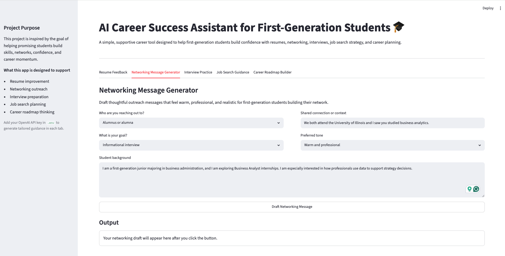

# AI-Career-Success-Assistant-for-First-Generation-Students

A Streamlit + OpenAI API project that helps first-generation and early-career
college students get practical career preparation support across five focused
workflows: resume feedback, networking outreach, interview practice, job search
guidance, and career roadmap planning.

This project was built as a lightweight portfolio MVP and is inspired by
[Braven's mission](https://braven.org/) to help promising students build the
skills, networks, confidence, and experience needed to access strong economic
opportunities.

---

## Table of Contents

- [Overview](#overview)
- [Problem Statement](#problem-statement)
- [Why This Matters](#why-this-matters)
- [Repository Structure](#repository-structure)
- [Features](#features)
- [Tech Stack](#tech-stack)
- [Architecture](#architecture)
- [How It Works](#how-it-works)
- [Responsible AI Considerations](#responsible-ai-considerations)
- [Setup Instructions](#setup-instructions)
- [Sample Use Cases](#sample-use-cases)
- [Future Improvements](#future-improvements)
- [Sample Use Cases](#sample-use-cases)
- [Conclusion](#conclusion)
- [Data Sources and References](#data-sources-and-references)
  
---

## Overview

The app is designed as a simple, guided experience rather than a general chat
tool. Each tab supports one concrete student need and returns structured,
action-oriented guidance that can help users move from uncertainty to next
steps.

The project prioritizes:
- Practical usefulness over platform complexity.
- Supportive, confidence-building language.
- Responsible AI boundaries.
- A clean structure that is easy to understand and extend.

**Live demo assets**
- Full demo video: [media/ai_career_assistant_demo.webm](media/ai_career_assistant_demo.webm)
- Sample UI screenshot: 

---

## Problem Statement

First-generation and early-career college students often have the talent and
motivation to succeed, but may have less access to informal career guidance,
resume feedback, professional networking examples, and interview preparation
support than peers with stronger built-in professional networks.

Career readiness advice is also frequently fragmented across different tools,
mentors, and internet resources. This project brings together a small set of
high-value workflows into one lightweight application that helps students take
practical action quickly.

---

## Why This Matters

Early career decisions can be high pressure, especially for students who are
learning professional norms in real time. A supportive tool can reduce friction
in moments such as:
- Rewriting resume bullets.
- Sending a first networking message.
- Preparing for a first internship interview.
- Organizing a job search plan.
- Translating long-term goals into short-term action.

The goal is not to replace mentors, advisors, or career centers. The goal is to
help students show up to those opportunities better prepared and more confident.

--- 

## Repository Structure

```text
.
├── app.py
├── .env.example
├── .gitignore
├── README.md
├── requirements.txt
├── docs/
│   ├── architecture.drawio
│   ├── responsible_ai_notes.md
│   └── sample_outputs.md
├── media/
│   ├── ai_career_assistant_demo.webm
│   └── demo_shot.png
├── prompts/
│   ├── __init__.py
│   ├── career_roadmap_builder.py
│   ├── interview_practice.py
│   ├── job_search_guidance.py
│   ├── networking_message_generator.py
│   ├── resume_feedback.py
│   ├── shared.py
│   └── system/
│       ├── base_system.txt
│       ├── career_roadmap_builder.txt
│       ├── interview_practice.txt
│       ├── job_search_guidance.txt
│       ├── networking_message_generator.txt
│       ├── resume_feedback.txt
│       └── shared_context.txt
└── utils/
    ├── __init__.py
    ├── openai_client.py
    └── prompt_loader.py
```
---

## Features

### Resume Feedback
- Reviews resume bullets or experience summaries against a target role.
- Highlights strengths, improvement areas, keywords, and ATS alignment ideas.

### Networking Message Generator
- Drafts LinkedIn connection notes, short emails, and polite follow-ups.
- Adapts tone based on audience and outreach goal.

### Interview Practice
- Generates likely interview questions, answer structures, and practice tips.
- Includes a tailored 60 or 30 second pitch example when that option is selected.

### Job Search Guidance
- Suggests role titles, search keywords, target organizations, and weekly strategy.
- Adjusts guidance to the student's stage, challenge, and available time.

### Career Roadmap Builder
- Creates a realistic 30/60/90 day roadmap with milestones and portfolio actions.
- Helps students connect long-term goals with weekly progress.

--- 

## Tech Stack

- `Python`
- `Streamlit`
- `OpenAI Python SDK`
- `python-dotenv`
- Markdown-based documentation and prompt assets

---

## Architecture

The application uses a lightweight Streamlit-based architecture where student inputs are transformed into structured prompts, enriched with responsible AI context, and sent to the OpenAI API to generate career guidance outputs.

<center>
  
</center>

**Architecture notes**
- `app.py` handles the UI, user inputs, buttons, and output rendering.
- `prompts/` contains feature-specific prompt builders plus shared system rules.
- `prompts/system/` stores the reusable context and safety instructions as text files.
- `utils/openai_client.py` centralizes API calls and error handling.
- `utils/prompt_loader.py` keeps prompt loading simple and reusable.
- `docs/` holds lightweight project context instead of introducing RAG or a vector database.

---

## How It Works

1. The user opens the app and chooses one of five services.
2. The user fills out the fields in that specific tab.
3. The app builds a structured user prompt from the form inputs.
4. A shared system prompt adds mission alignment, tone guidance, and safety rules.
5. The OpenAI API generates a structured response.
6. The app displays career guidance inside the same tab with a visible responsible AI note.

---

## Responsible AI Considerations

This project includes a lightweight responsible AI layer because career guidance
can influence high-stakes decisions.

Key safeguards:
- The assistant does not guarantee employment outcomes.
- The prompts explicitly discourage fabrication of experience, credentials, or achievements.
- The system encourages users to review and personalize outputs before using them.
- The safety rules discourage biased, discriminatory, or stereotype-based guidance.
- The assistant should not ask for sensitive personal information unless clearly necessary.
- The app is positioned as support for career preparation, not a replacement for human coaching.

Additional notes are available in
[docs/responsible_ai_notes.md](docs/responsible_ai_notes.md).

---

## Setup Instructions

### Prerequisites
- Python 3.10+
- An OpenAI API key

### Local setup

1. Clone the repository.
2. Create and activate a virtual environment.
3. Install dependencies:

```bash
pip install -r requirements.txt
```

4. Create a local environment file:

```bash
cp .env.example .env
```

5. Add your OpenAI API key to `.env`:

```env
OPENAI_API_KEY=your_key_here
OPENAI_MODEL=gpt-5.4-mini
```

6. Run the app:

```bash
streamlit run app.py
```
---

## Sample Use Cases

The manual testing set for this project uses three realistic personas:

- A first-generation business student targeting a Business Analyst internship.
- A Computer Science student targeting a Software Engineering internship.
- An Information Management graduate student targeting Analytics Engineer new grad roles.

Those test cases cover all five services and are documented in
[docs/sample_outputs.md](docs/sample_outputs.md).

Examples of supported use cases:
- Improve internship resume bullets for a business student.
- Draft a respectful networking note to an alum in a target field.
- Practice software engineering interview questions with a tailored pitch example.
- Build a weekly job search strategy for a student with limited time.
- Create a 30/60/90-day roadmap toward analytics engineering roles.

---

## Future Improvements

- Add richer input validation and more user-friendly empty-state guidance.
- Save session history locally for the current user session.
- Add export options for resume feedback and roadmap outputs.
- Improve visual polish and mobile responsiveness.
- Add curated example prompts for first-time users.
- Expand testing coverage with more personas and edge cases.

---

## Conclusion

This project demonstrates how a small, focused AI application can be both
technically simple and mission-aware. Instead of trying to build a complex
career platform, it delivers a clear set of practical workflows that reflect the
real needs of first-generation and early-career students.

For a portfolio project, that balance matters: the app shows product thinking,
prompt design, responsible AI considerations, and clean implementation without
overbuilding the solution.
